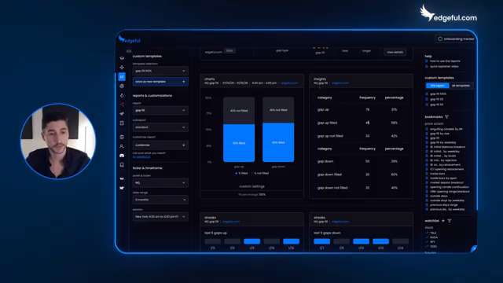
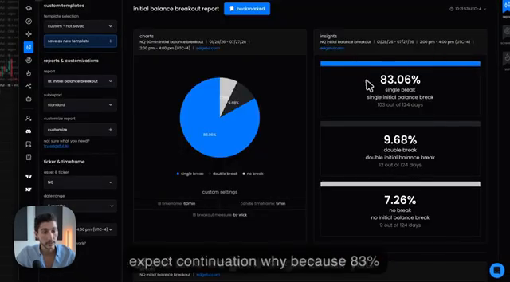
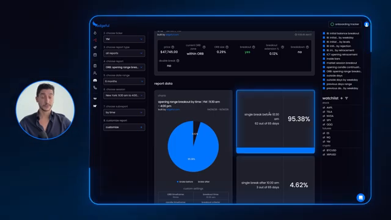
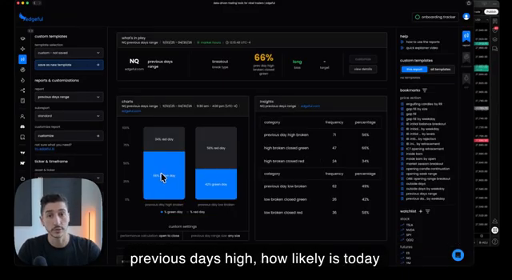
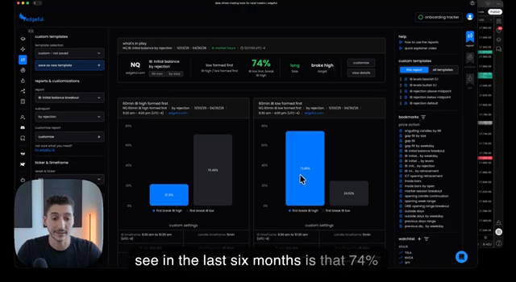
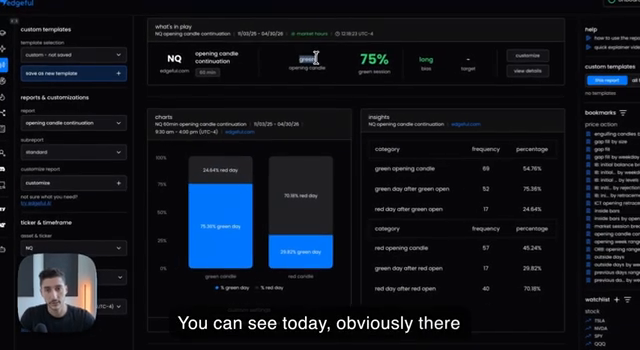
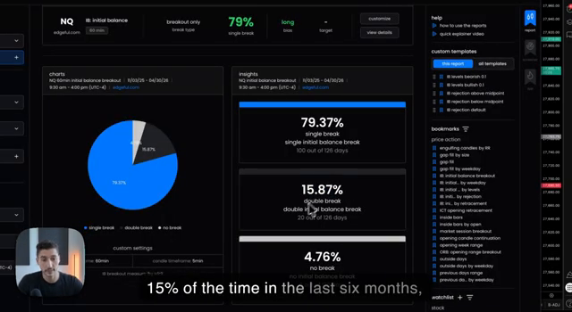
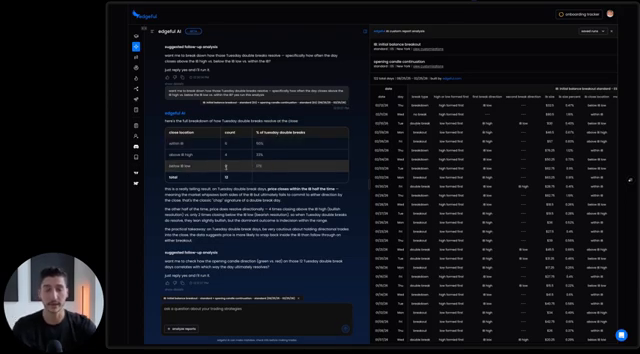
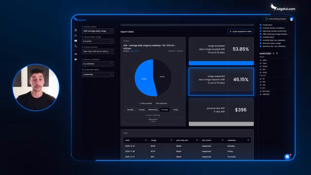

# Edgeful screenshot evidence

**Captured:** 2026-08-02
**Purpose:** Review evidence for the [research report](../../edgeful-conditional-market-statistics-2026-08-02.md), [implementation plan](../../edgeful-concept-behavior-atlas-plan-2026-08-02.md), and [v1 specification](../../edgeful-concept-behavior-atlas-spec-2026-08-02.md).

These are direct frames from the linked public videos at the stated timestamps. They document what the demonstrations visibly showed. They do not independently validate Edgeful's source data or private methodology.

## 1. Report selectors, counts, and rows

[Source video at 02:09](https://www.youtube.com/watch?v=ihe71f_H12A&t=129s)

Supports: market/lookback selectors, separate gap-up/gap-down counts and percentages, and dated rows.

SHA-256: `116b7000477c7984eb4d37b8384f4fb56536f776fa280450dec6a7b59c495318`

## 2. Multiclass initial-balance frequencies

[Source video at 05:05](https://www.youtube.com/watch?v=6HYJD3SEcLk&t=305s)

Supports: 83.06% single-break, 9.68% double-break, and 7.26% no-break classes in the displayed 124-session cohort.

SHA-256: `2fba51c3c54d100bcee7e080eb65861c46a9f27825deb9c9ef305fb4f6cb2461`

## 3. Eventual-class timing denominator

[Source video at 03:47](https://www.youtube.com/watch?v=O-G2j2D7vvM&t=227s)

Supports: the displayed 95.38% before-time result and the `single break` selector. This is evidence of a post-hoc timing distribution, not automatically an open-of-session forecast.

SHA-256: `4298c41809c9d96885b370b44fb43a20762b4349e22043972c283ace49965955`

## 4. Four marginal reports used as confluence

### 4.1 Prior-day high

[Source video at 00:21](https://www.youtube.com/watch?v=lhU2wiJfWs0&t=21s)

SHA-256: `a5189971f7647b493eb24444cddff42149099c4a9dfab20c8f6685515ddf53a1`

### 4.2 Initial-balance formation order

[Source video at 01:15](https://www.youtube.com/watch?v=lhU2wiJfWs0&t=75s)

SHA-256: `aa1687fd4e3ffc6bae82edd2616ea7f6e75e722614d1f33b9a78ca909b4652d0`

### 4.3 Opening candle

[Source video at 01:59](https://www.youtube.com/watch?v=lhU2wiJfWs0&t=119s)

SHA-256: `a41835bf7eebca3e27d80b4fa89de6c04cbfbcc6128ddabe7564801066643b45`

### 4.4 Initial-balance outcome classes

[Source video at 03:05](https://www.youtube.com/watch?v=lhU2wiJfWs0&t=185s)

SHA-256: `0ba0ebee81cb10f82fdf99bb5e5f05e2bc971dbb2f97f7750205901a66175d29`

Together these four frames support that separate marginal reports were consulted. They do not display the row-level intersection where all predicates were simultaneously true and therefore do not establish a combined probability.

## 5. Date-aligned report rows behind AI

[Source video at 08:27](https://www.youtube.com/watch?v=eebhWxnEbHA&t=507s)

Supports: the AI surface is backed by structured, date-aligned report rows. It does not establish statistical correction for model-selected subgroups.

SHA-256: `c735a67abe02425e91c41f0c38201b05a1190f97c7c6d981db17357669fa4d18`

## 6. Weekday-conditioned ADR report

[Source video at 04:00](https://www.youtube.com/watch?v=LyRdL7hM8sE&t=240s)

Supports: regrouping one report by weekday and displaying corresponding counts/rates. It illustrates that the selector and report definition are part of the claim.

SHA-256: `418d29e946a536081fb5e8feba53e1b15f1b0691c4fb4865555175221af2860f`
